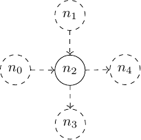

# FPMAS Dynamic Graph Management example

The complete working examples corresponding to the [Dynamic Distributed Graph
Management wiki
page](https://github.com/FPMAS/FPMAS/wiki/Dynamic-Distributed-Graph-Management).

An executable is built for each operation :
- `fpmas-link`
- `fpmas-build-node`
- `fpmas-unlink`
- `fpmas-remove-node`

# Build
All targets can be built with the following script :
```
mkdir build
cd build
cmake ..
make
```
The default synchronization mode is
[HardSyncMode](https://fpmas.github.io/FPMAS/classfpmas_1_1synchro_1_1hard_1_1HardSyncMode.html).
However, dynamic graph operations are available in **any** synchronization
mode. So, for the purpose of demonstration, the synchronization mode can be
chosen at compile time, replacing the third line of the previous script by
```
cmake -DSYNC_MODE=<sync_mode> ..
```
Example :
```
cmake -DSYNC_MODE=GhostMode ..
```

# Run
All examples are assumed to be run on at least 2 processes. Extra processes
will be ignored.

Example :
```
mpiexec -n 2 fpmas-link
```

# Initial Graph
In any case, operations are applied on process 0 from a task bound to node
`n_2`, which is the only node located on process 0.

The local representation of the initial graph from process 0 is as followed :



See [dynamic_graph.cpp](dynamic_graph.cpp) to see how the initial graph is
built from process 0.

# Link

# Build Node
## Code
See [build_node.cpp](build_node.cpp).

```cpp
fpmas::communication::MpiCommunicator comm;
fpmas::DistributedGraph<int, SYNC_MODE> graph {comm};
std::array<DistributedId, 5> nodes;

init_graph(nodes, graph);

FPMAS_ON_PROC(comm, 0) {
	auto n_2 = graph.getNode(nodes[2]);
	// Binds task t to n_2
	auto t = FPMAS_NODE_TASK(n_2, {
			auto n_6 = graph.buildNode(0);
			// Links n_2 to the new node
			graph.link(n_2, n_6, DYNAMIC_LAYER);

			// Links node_2 to n_3 and n_4
			for(auto node : n_2->outNeighbors(INIT_LAYER))
			graph.link(n_6, node, DYNAMIC_LAYER);
			});
	// Run the task on process 0
	t.run();
}
// Synchronize the graph from all processes
graph.synchronize();
```

## Output

```
== SYNC_MODE : HardSyncMode

==========================
== Initial distribution ==
==========================
== [Proc 0] ==
== Local Nodes :
- [0:4] [DISTANT]
- [0:3] [DISTANT]
- [0:2] [LOCAL]
- [0:1] [DISTANT]
- [0:0] [DISTANT]
== Local edges :
- [0:3] : [0:2] -> [0:4] (INIT_LAYER)
- [0:2] : [0:2] -> [0:3] (INIT_LAYER)
- [0:1] : [0:1] -> [0:2] (INIT_LAYER)
- [0:0] : [0:0] -> [0:2] (INIT_LAYER)

== [Proc 1] ==
== Local Nodes :
- [0:2] [DISTANT]
- [0:0] [LOCAL]
- [0:1] [LOCAL]
- [0:3] [LOCAL]
- [0:4] [LOCAL]
== Local edges :
- [0:3] : [0:2] -> [0:4] (INIT_LAYER)
- [0:2] : [0:2] -> [0:3] (INIT_LAYER)
- [0:1] : [0:1] -> [0:2] (INIT_LAYER)
- [0:0] : [0:0] -> [0:2] (INIT_LAYER)

==========================
==  Final distribution  ==
==========================
== [Process 0] ==
== Local Nodes :
- [0:5] [LOCAL]
- [0:4] [DISTANT]
- [0:3] [DISTANT]
- [0:2] [LOCAL]
- [0:1] [DISTANT]
- [0:0] [DISTANT]
== Local edges :
- [0:6] : [0:5] -> [0:4] (DYNAMIC_LAYER)
- [0:5] : [0:5] -> [0:3] (DYNAMIC_LAYER)
- [0:4] : [0:2] -> [0:5] (DYNAMIC_LAYER)
- [0:3] : [0:2] -> [0:4] (INIT_LAYER)
- [0:2] : [0:2] -> [0:3] (INIT_LAYER)
- [0:1] : [0:1] -> [0:2] (INIT_LAYER)
- [0:0] : [0:0] -> [0:2] (INIT_LAYER)

== [Process 1] ==
== Local Nodes :
- [0:5] [DISTANT]
- [0:2] [DISTANT]
- [0:0] [LOCAL]
- [0:1] [LOCAL]
- [0:3] [LOCAL]
- [0:4] [LOCAL]
== Local edges :
- [0:6] : [0:5] -> [0:4] (DYNAMIC_LAYER)
- [0:5] : [0:5] -> [0:3] (DYNAMIC_LAYER)
- [0:3] : [0:2] -> [0:4] (INIT_LAYER)
- [0:2] : [0:2] -> [0:3] (INIT_LAYER)
- [0:1] : [0:1] -> [0:2] (INIT_LAYER)
- [0:0] : [0:0] -> [0:2] (INIT_LAYER)
```
Notice that the new node `[0:5]`, and links `[0:6]` and `[0:5]`, all
created from process 0, are automatically imported to process 1. However, edge
`[0:4]`, connecting `[0:2]` to `[0:5]`, is **not** imported on process 1, since
those two nodes are `DISTANT` from process 1.

# Unlink

# Remove Node
